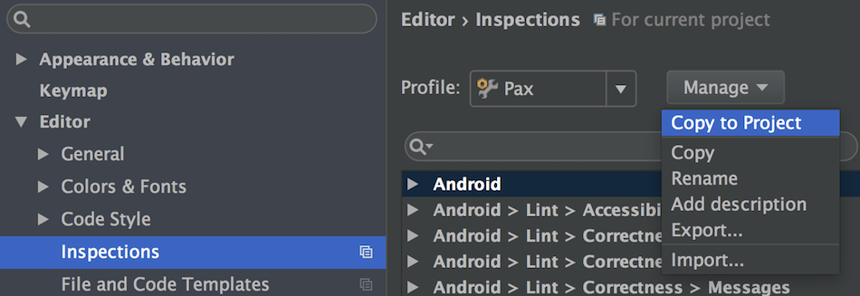
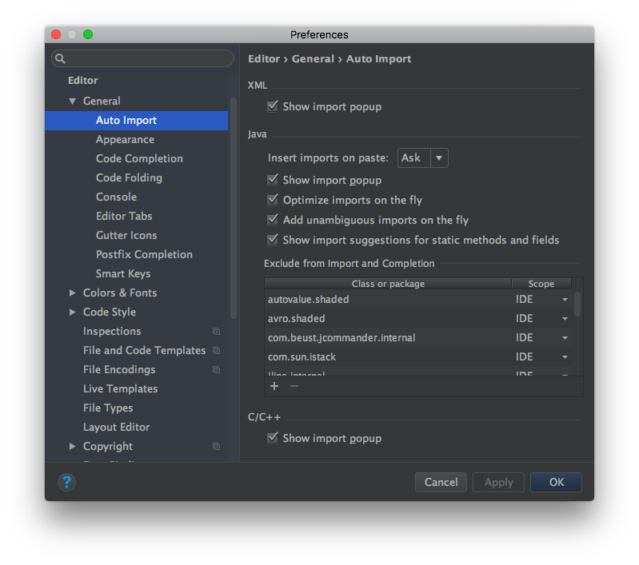
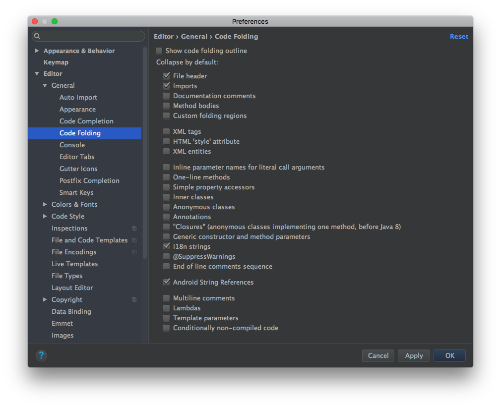
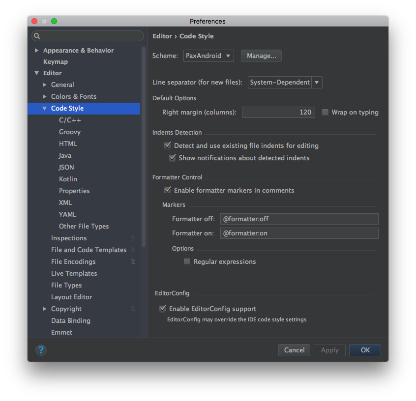
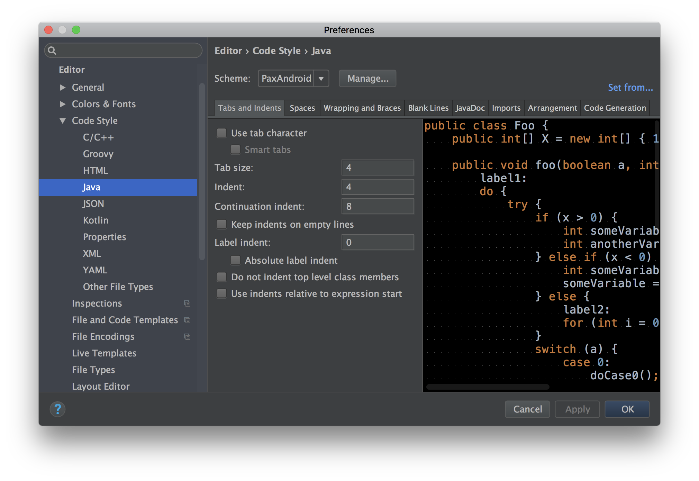
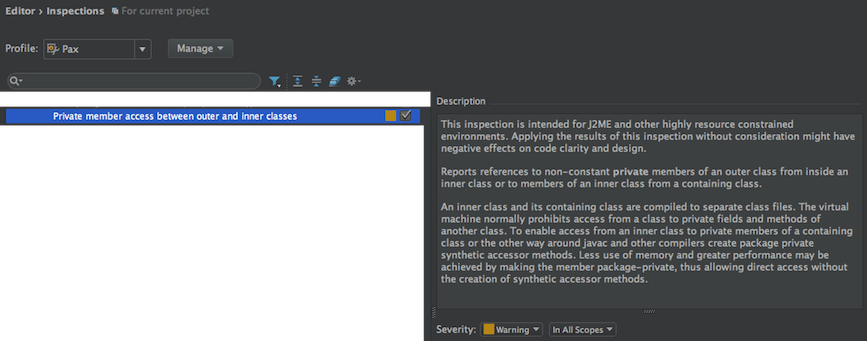

# Java Code Styles

IntelliJ IDEA code style settings for PAX's Java and Android projects.

## Installation

 * On Unix, run the `install.sh` script. Windows users should use `install.bat` instead.
 * Restart IntelliJ if it's running.
 * Open IntelliJ Project Settings -> Code Styles, change the code style for the
   project to the one you want.

### Inspections

* Open IntelliJ Project Settings -> Editor -> Inspections
* Choose `Pax` profile
* Press `Manage` dropdown button
* Select `Copy to Project`

## Preferences

### General

#### Auto Import

#### Code Folding

### Code Style

#### Java

##### Tabs and Indents

#### XML

##### Tabs and Indents

##### Android

## Inspections

### Private member access

## License

