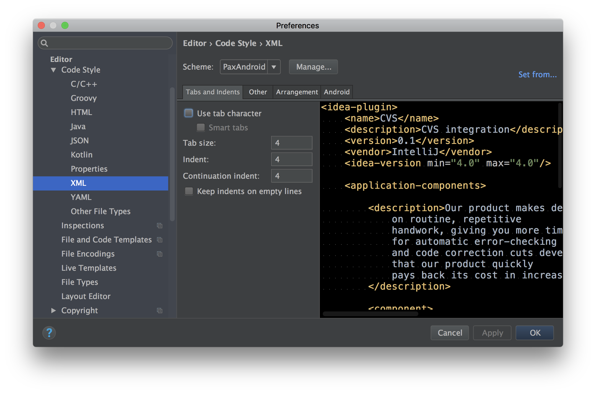
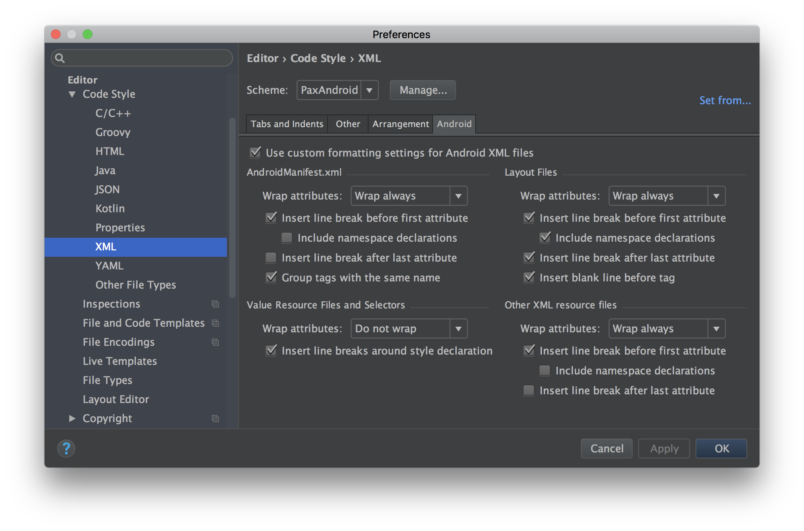

Java Code Styles
================

IntelliJ IDEA code style settings for PAX's Java and Android projects.

Installation
------------

 * On Unix, run the `install.sh` script. Windows users should use `install.bat` instead.
 * Restart IntelliJ if it's running.
 * Open IntelliJ Project Settings -> Code Styles, change the code style for the
   project to the one you want.

Preferences
--------

### Code Style

#### XML

##### Tabs and Indents

##### Android

License
-------

